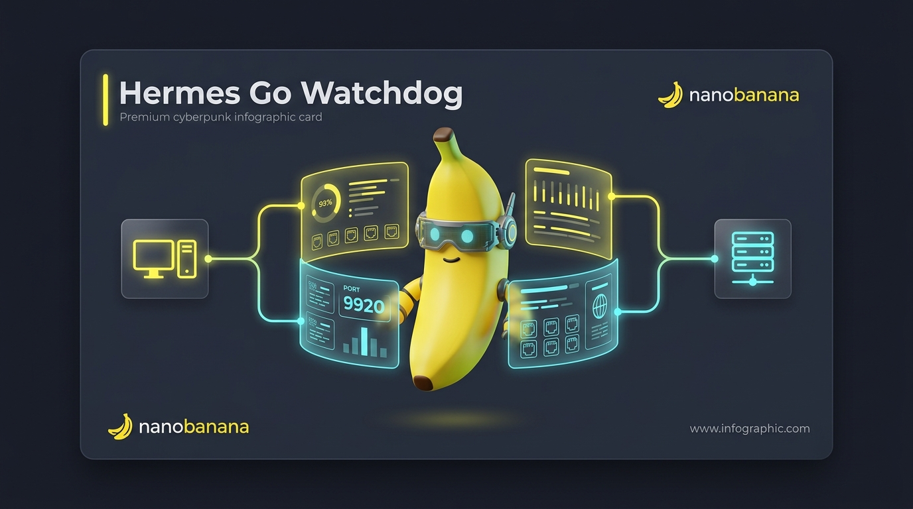
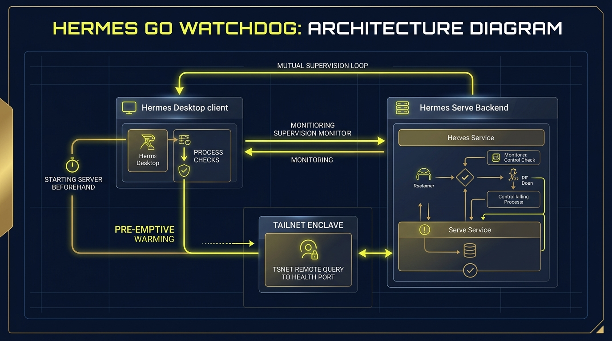

# Hermes Desktop Watchdog

An independent Go lifecycle manager for Hermes Agent Desktop and backend, focused on health supervision, controlled recovery, orphan cleanup, and Windows process hygiene.

`	ext
Hermes Agent
    ↕ health / lifecycle contract
Hermes Desktop Watchdog
`

Hermes Desktop Watchdog is an independent, community-maintained lifecycle manager for NousResearch Hermes Agent Desktop and its backend.

It is not an official NousResearch component, Hermes plugin, MCP server, skill, or cron provider.

---

## 🎨 System Overview & Architecture

For a quick visual overview of the watchdog's operation, refer to the diagrams below:

### System Mascot Infographic

### Architecture Diagram

---

## Key Features

- **Desktop and backend health supervision:** Actively monitors both Hermes.exe (Desktop electron app) and hermes serve (Python backend) to ensure continuous operability.
- **Single restart authority:** The watchdog acts as the sole decider for service restarts, preventing split-brain conditions or restart loops where both systems try to restart each other.
- **Crash-loop backoff:** Implements progressive cooldown periods and moves to StateFailed if the service remains unrecoverable after multiple consecutive attempts.
- **Orphan process cleanup:** Reaps orphaned Python backends, conhost instances, or dangling MCP subprocesses on Windows.
- **Warm-start lifecycle preparation:** Manages early server spawning (prewarm-backend) to allow near-instantaneous Desktop reconnection without cold-start delays.
- **Windows-first process hygiene:** Built to handle Windows-specific behaviors like process trees, PID reuse, and monotonic wakeups from machine sleep/resume.

---

## Implemented vs Planned Scope

### Implemented
- Mutual health observation (/health, /api/status)
- Watchdog-owned restart decisions (sole authority)
- Crash-loop recovery and fail counts
- Orphan cleanup and process harvesting on Windows
- Pre-warm backend and desktop-backend.json manifest generation

### Planned
- Full backend drain/checkpoint protocol (ADR P4)
- Renderer-only process tree recovery (ADR P5)
- Windows Job Object ownership for child sub-trees (ADR P5)

---

## Safety Model & Security

For details on our threat mitigation design, please read [SECURITY.md](SECURITY.md). Key safety rules enforced by design:
- **Loopback only:** The HTTP API listens only on localhost (127.0.0.1:9920) by default.
- **Admin token authorization:** All mutation endpoints require a valid HERMES_WATCHDOG_ADMIN_TOKEN via Bearer token or header authentication.
- **No arbitrary command execution:** Commands are strictly mapped to an allowlist (e.g., executing the specified python binary and package).
- **Executable path pinning:** Relaunches utilize fixed, detected, or verified executable targets.
- **Exclusion of reserved ports:** The watchdog will never bind or claim ports reserved for Hermes stack operations.

---

## Tested Versions

- **Hermes Agent:** 0.18.2 (main commit: 54f70c2663375ff5df5fb6c1c6d0ef286b1d12b9)
- **OS:** Windows 10 / 11 (WSL2 usage is *not tested*)
- **Watchdog:** Go 1.25.0 / 1.26.5 (architecture: md64)

---

## Building the Watchdog

Ensure Go (1.25+) is installed. Run the following script:

`powershell
powershell -NoProfile -ExecutionPolicy Bypass -File scripts\windows\Build-HermesGoWatchdog.ps1
`

The resulting binary will be saved to scripts\windows\watchdog-go\dist\hermes-watchdog.exe.

---

## Running the Watchdog

Run the start script to launch the watchdog detached:

`powershell
# Set optional configuration token
 = "your-secure-operator-token"

powershell -NoProfile -ExecutionPolicy Bypass -File scripts\windows\Start-HermesGoWatchdog.ps1
`

### CLI Parameters

| Flag | Default | Description |
|------|---------|-------------|
| -IntervalSec | 20 | Supervision poll interval |
| -FailThreshold | 2 | Allowed consecutive backend failures before Desktop restart |
| -Once | off | Runs a single supervision loop and exits |
| -NoTsnet | off | Force disables Tailscale 	snet binding |
| -Listen | 127.0.0.1:9920 | Local HTTP endpoint address |

---

## HTTP API

| Method | Path | Authentication | Description |
|--------|------|----------------|-------------|
| GET | /health | None | Returns basic watchdog liveness status |
| GET | /api/status | None | Returns full health status JSON |
| POST | /api/v1/pause | Admin Token | Pauses watchdog loop supervision |
| POST | /api/v1/resume | Admin Token | Resumes watchdog loop supervision |
| POST | /api/v1/cycle | Admin Token | Forces a single immediate check cycle |
| POST | /api/v1/stop | Admin Token | Gracefully stops the watchdog process |

---

## License

This project is licensed under the MIT License. See [LICENSE](LICENSE) for details.
