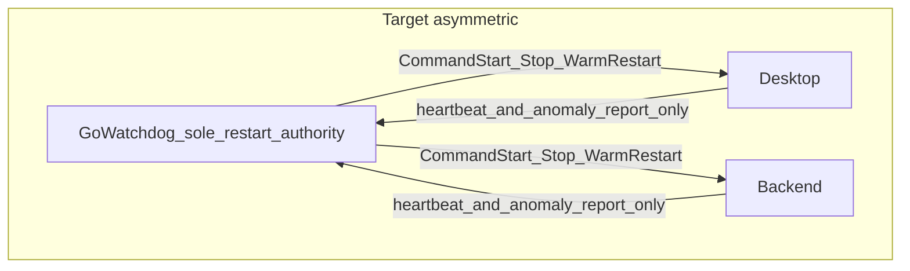
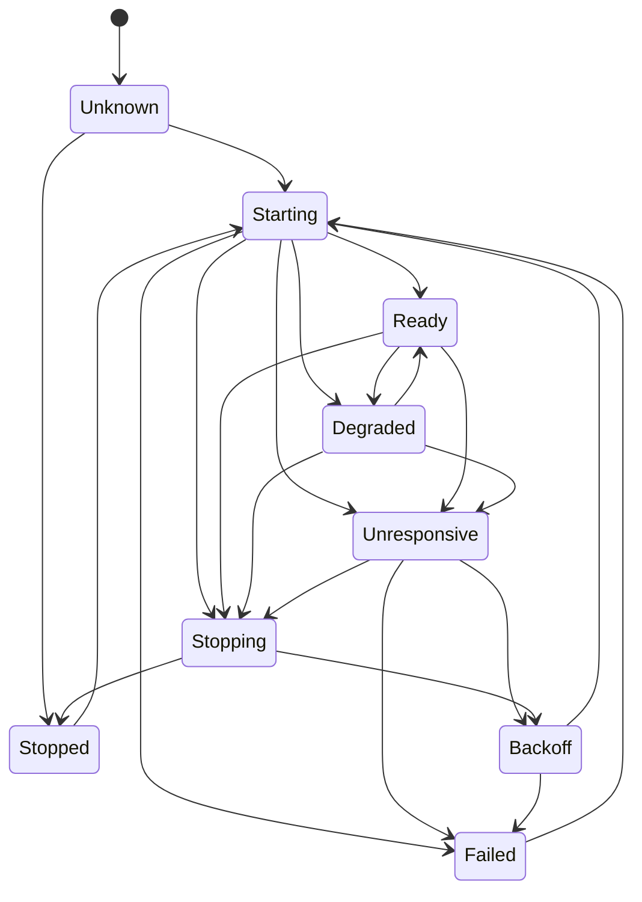
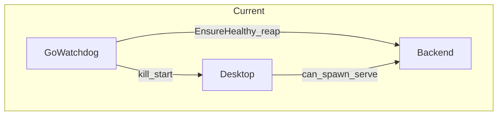

# ADR-2026-07-21: Hermes Go Watchdog as Desktop/Backend Lifecycle Manager

## Status

Accepted (design baseline for phased PRs)

## Date

2026-07-21

## Related Requirements

| ID | Source | Summary |
|----|--------|---------|
| REQ-LM-01 | Design review 2026-07-21 | Asymmetric restart authority (Watchdog sole) |
| REQ-LM-02 | Design review 2026-07-21 | Explicit `ServiceState` machine (not bool/string labels) |
| REQ-LM-03 | Design review 2026-07-21 | Heartbeat with `instance_id` + `epoch` |
| REQ-LM-04 | Design review 2026-07-21 | Safe warm restart (persist reconstructable state only) |
| REQ-LM-05 | Design review 2026-07-21 | Crash-loop `RestartPolicy` with Failed stop |
| REQ-LM-06 | Design review 2026-07-21 | Multi-level health (`/live`, `/ready`, `/health/deep`) |
| REQ-LM-07 | Design review 2026-07-21 | Desktop main vs renderer vs backend restart granularity |
| REQ-LM-08 | Design review 2026-07-21 | Windows Job Object + process-tree hygiene |
| REQ-LM-09 | Design review 2026-07-21 | Local IPC (Named Pipe preferred; HTTP fallback) |
| REQ-LM-10 | Design review 2026-07-21 | Command allowlist security |
| REQ-LM-11 | Design review 2026-07-21 | Machine-readable restart events |
| REQ-OPS-01 | [AGENTS.md](../AGENTS.md) | Operator-only; not plugin/MCP/skill/cron |
| REQ-OPS-02 | [SECURITY.md](../SECURITY.md) | Admin token for mutating APIs; no secrets in repo |

## Context

### Background

Hermes Desktop repeatedly hits: backend restart loops, orphan processes, residual MCP children, half-dead gateway, and post-update recovery failure. The standalone Go watchdog ([`zapabob/HermesDesktopwatchdog`](https://github.com/zapabob/HermesDesktopwatchdog)) already watches Desktop and backend, reaps orphans, and gates mutating APIs with an admin token.

A design review (2026-07-21) argued that value comes from separating:

1. **Liveness** — process exists
2. **Health** — API / WebSocket / session DB / event loop respond
3. **Warm start** — safe return while reconstructing durable state

and that mutual *monitoring* is fine, but **restart authority must be asymmetric** to avoid restart storms and split-brain.

### Constraints

- This repository remains **operator-only** (not registered as Hermes plugin/tool/skill/MCP/cron).
- Reserved ops ports `8787` / `9120` / dashboard listeners must never be treated as Desktop backends.
- Secrets stay in env (`HERMES_WATCHDOG_ADMIN_TOKEN`, Tailscale auth keys); never commit `.env` or built `.exe`.
- hermes-agent Desktop/Backend protocol changes ship as **separate PRs**; this ADR defines contracts first.

### Assumptions

- Packaged Desktop is `Hermes.exe`; managed backend is watchdog-owned `hermes serve` (default port `9118`).
- Heartbeat timeout uses **monotonic elapsed time** (`time.Since` / runtime clock), not wall clock, so sleep/resume does not false-trigger mass restarts.
- Phase 1 ships inside this repo only; Desktop/Backend become report-only in later phases.

### Problem

Current control loop is effective as an ops helper but is still a shallow supervisor:

- Health ≈ process alive + shallow `/api/status` probe.
- Desktop may still spawn its own serve → dual restart authority risk.
- State is string labels (`"up"|"down"|"restarted"`), not a state machine.
- Fail counter lacks windowed backoff and hard `Failed` stop.
- No epoch/lease, no warm-start drain, no Job Object, no command allowlist IPC.

## Decision

### 1. Asymmetric restart authority (REQ-LM-01)

**Adopted topology:**

```text
Go Watchdog
├─ monitors Desktop
├─ monitors Backend
├─ owns epoch / lease
└─ sole authority to start / stop / warm-restart

Desktop
├─ monitors Backend heartbeat (observe)
└─ reports anomalies to Watchdog (no kill/restart)

Backend
├─ monitors Desktop heartbeat (observe)
└─ reports anomalies to Watchdog (no kill/restart)
```

Desktop and Backend **must not** directly kill/restart each other. They report; Watchdog decides.

### 2. ServiceState machine (REQ-LM-02)

```go
type ServiceState int

const (
    StateUnknown ServiceState = iota
    StateStarting
    StateReady
    StateDegraded
    StateUnresponsive
    StateStopping
    StateStopped
    StateBackoff
    StateFailed
)
```

**Allowed transitions (normative):**

| From | To |
|------|-----|
| Unknown | Starting, Stopped |
| Stopped | Starting |
| Starting | Ready, Degraded, Unresponsive, Stopping, Failed |
| Ready | Degraded, Unresponsive, Stopping |
| Degraded | Ready, Unresponsive, Stopping |
| Unresponsive | Stopping, Backoff, Failed |
| Stopping | Stopped, Backoff |
| Stopped | Starting |
| Backoff | Starting, Failed |
| Failed | Starting (manual/operator only) |

**Invariant:** `process exists ≠ healthy`. Electron and Python backend can be alive with dead APIs.

### 3. Heartbeat / IPC contract (REQ-LM-03, REQ-LM-09)

Envelope (all messages):

```json
{
  "protocol_version": 1,
  "message_type": "heartbeat",
  "instance_id": "uuid",
  "epoch": 12,
  "sent_at_mono_ms": 123456789,
  "payload": {}
}
```

Heartbeat payload (minimum):

```json
{
  "service": "hermes-backend",
  "pid": 12345,
  "instance_id": "uuid",
  "epoch": 42,
  "started_at": "2026-07-20T12:00:00Z",
  "last_activity_at": "2026-07-20T12:05:00Z",
  "state": "ready",
  "session_db_ready": true,
  "gateway_ready": true,
  "mcp_ready": true,
  "active_runs": 2,
  "rss_bytes": 734003200
}
```

**Transport phasing:**

| Phase | Transport |
|-------|-----------|
| P1–P2 | Loopback HTTP (extend existing `127.0.0.1` server) |
| P3+ | Windows Named Pipe primary; Unix domain socket on non-Windows; HTTP fallback |

`instance_id` distinguishes process reincarnation; `epoch` invalidates stale heartbeats / leases after restart intent.

### 4. Warm start (REQ-LM-04)

Warm start **does not** restore process memory. It reconstructs from durable state.

**Keep (reconstruct):**

- `state.db`
- gateway routing state
- active profile
- session ID
- selected provider / model
- pending run metadata
- approval pending state
- cron claim state
- MCP server *desired* state
- Desktop last route / chat
- restart reason
- shutdown cleanliness

**Do not keep (always recreate):**

- in-flight HTTP connections
- old WebSockets
- MCP transport objects
- subprocess handles
- in-memory locks
- event-loop tasks
- provider client instances

**Safe warm restart sequence:**

```text
1. Watchdog issues restart intent (bump epoch / lease)
2. Backend → draining
3. Stop accepting new runs
4. Grace period for active runs
5. Checkpoint to state.db
6. Close MCP / child processes
7. Stop Backend
8. Start new Backend
9. Readiness check
10. Restore session routing
11. Notify Desktop backend-ready
12. Resume traffic
```

If active runs miss the deadline: force stop and record **`interrupted`** (never success).

### 5. RestartPolicy (REQ-LM-05)

```go
type RestartPolicy struct {
    MaxRestarts    int
    Window         time.Duration
    InitialBackoff time.Duration
    MaxBackoff     time.Duration
    ResetAfter     time.Duration
}
```

**Defaults:**

| Parameter | Value |
|-----------|-------|
| InitialBackoff | 1s |
| Growth | ×2 per attempt (1, 2, 4, 8, …) |
| MaxBackoff | 60s |
| ResetAfter | 10 minutes stable in Ready |
| MaxRestarts / Window | e.g. 5 / 10m → then `StateFailed` (auto-recovery stops) |

### 6. Multi-level health (REQ-LM-06)

| Endpoint | Meaning | Cadence |
|----------|---------|---------|
| `/live` | process + event loop answer | frequent |
| `/ready` | can accept new sessions | frequent |
| `/health/deep` | state.db R/W, profile load, provider construct, gateway DB, MCP manager, cron, approval, FS writable, disk, child count, event-loop lag | low frequency or cached |

Watchdog must not treat `/live` alone as Ready.

### 7. Desktop restart granularity (REQ-LM-07)

| Fault | Action |
|-------|--------|
| Renderer crash / OOM | Recreate Desktop UI only (when detectable) |
| Backend unhealthy | Backend restart / warm restart |
| Electron main crash | Full Desktop restart |

Avoid session interruption when only the renderer died.

### 8. Windows process hygiene (REQ-LM-08)

Prefer over bare `taskkill` long-term:

- Windows Job Object for child grouping
- `CREATE_NO_WINDOW`
- process-tree kill via Job Object
- identify Git Bash / WSL shims
- exclude Windows Store Python stub
- Named Pipe reconnect
- stale port hold detection on restart
- avoid update while `.pyd` locked
- watch residual `conhost` / OpenConsole

### 9. Security (REQ-LM-10)

Watchdog holds process-launch power. Minimum controls:

- loopback / local IPC only (tsnet remains operator-gated)
- per-installation token
- message timestamp + replay nonce
- **command allowlist** (no free-form cmdline from Desktop)
- fixed executable paths
- argument allowlist
- environment allowlist (do not blindly inherit full `.env`)
- never log secrets

```go
type CommandType string

const (
    CommandStartDesktop CommandType = "start_desktop"
    CommandStartBackend CommandType = "start_backend"
    CommandStopBackend  CommandType = "stop_backend"
    CommandWarmRestart  CommandType = "warm_restart"
)
```

### 10. Observability (REQ-LM-11)

```json
{
  "event": "service_restart",
  "service": "backend",
  "reason": "readiness_timeout",
  "previous_pid": 1234,
  "new_pid": 5678,
  "attempt": 3,
  "backoff_ms": 4000,
  "warm_start": true,
  "session_restored": true,
  "session_id": "...",
  "run_id": "..."
}
```

Correlate with Hermes trajectory / session events when IDs are available.

### Scope

- Normative for this repository’s phased PRs (P1–P6).
- Contractual for hermes-agent Desktop/Backend adapters (separate PRs).

## Alternatives Considered

### A. Keep mutual kill/restart between Desktop and Backend

- Pros: no new IPC; matches some “mutual watchdog” wording in README.
- Cons: restart storms, split-brain, dual authority.
- **Rejected:** violates REQ-LM-01.

### B. Generic OS supervisor only (e.g. NSSM / systemd-like)

- Pros: less code.
- Cons: cannot encode Hermes-specific health, warm-start, MCP desired state, interrupted runs.
- **Rejected:** loses Hermes-domain value.

### C. Jump immediately to Named Pipe + Job Object + full warm-start

- Pros: end-state sooner.
- Cons: unreviewable mega-PR across two repos.
- **Rejected:** phased boundaries below.

## Consequences

### Benefits

- Single decision point for restart → fewer storms / split-brain.
- Explicit states enable correct backoff and operator `Failed` handling.
- Warm-start contract reduces “half-dead gateway” and orphan MCP children.
- Testable acceptance criteria for PRs.

### Tradeoffs

- Requires hermes-agent cooperation (report-only Desktop/Backend) before full asymmetry is real.
- Deeper health probes cost CPU; deep health must stay low-frequency.
- Job Object / Named Pipe add Windows-specific code paths.

### Operational notes

- Until P3, Desktop may still cold-spawn serve; Watchdog must continue to skip managed port `9118` and reserved ops ports when reaping.
- Update windows must suppress auto-restart (P6) or operators pause via `/api/v1/pause`.

---

## Current vs Target Architecture

### Target (asymmetric)



### ServiceState



---

## Gap Analysis — Current Codebase

### Current topology



### Code map

| Area | Current behavior | Key symbols | Gap vs ADR |
|------|------------------|-------------|------------|
| Control loop | Serial cycle: Desktop down → relaunch; backend down → `EnsureHealthy`; fail threshold → full Desktop tree-kill | [`RunCycle`](../watchdog.go) | No state machine; Desktop restart is blunt; dual authority risk |
| Desktop restart | `taskkill /T /F` then relaunch exe | [`restartPackagedDesktop`](../process_windows.go), [`stopAllDesktopProcessTrees`](../process_windows.go) | No Job Object; no main/renderer split |
| Backend health | `processAlive` + HTTP `/api/status` | [`testBackendStatus`](../process_windows.go), [`EnsureHealthy`](../backend.go) | No `/live`/`/ready`/`deep`; no heartbeat epoch |
| Manifest | `desktop-backend.json` URL/token/port | [`DesktopBackendManifest`](../backend.go) | Not a warm-start checkpoint; no drain/interrupted |
| Crash loop | `failCount` vs `FailThreshold` | [`Watchdog.failCount`](../watchdog.go) | No window/backoff/Failed |
| HTTP API | `/health`, `/api/status`, pause/resume/cycle/stop | [`server.go`](../server.go) | No heartbeat ingest; no allowlisted CommandType |
| Lock | Single-instance lock file | [`acquireLock`](../watchdog.go) | Not an epoch/lease for services |
| Security | Admin token for mutating routes | [`requireAdmin`](../server.go) | No nonce/command allowlist/path pin for IPC commands |

### Highest-risk current path (restart race / storm seed)

```text
RunCycle:
  Desktop missing → startPackagedDesktop
  Backend missing → EnsureHealthy
  still missing && failCount >= FailThreshold
    → restartPackagedDesktop (kill all Hermes.exe trees + reap orphans + start)
```

If Desktop independently respawns serve while Watchdog also restarts Desktop/backend, authorities collide. **Mitigation path:** P1 encodes sole authority in Watchdog policy; P3 makes Desktop report-only in hermes-agent.

### PR review focus (requested)

| Focus | Current status | ADR phase that closes it |
|-------|----------------|--------------------------|
| Restart race | Serial cycle helps but no epoch/lease | P1 + P2 |
| Split-brain | Dual spawn possible | P1 policy + P3 adapter |
| Windows process tree | `taskkill /T` only | P5 |
| Warm-start consistency | Manifest only | P4 |

---

## Phased PR Roadmap

| Phase | Scope | Repo | Exit criteria |
|-------|-------|------|---------------|
| **P1** | Authority policy in-loop + `ServiceState` + `RestartPolicy` + machine-readable restart events | this repo | States persisted; backoff works; Failed stops auto-restart; tests for loop/backoff |
| **P2** | Consume `/live` `/ready`; optional cached deep; heartbeat ingest API | this repo (+ backend health routes in hermes-agent as needed) | Stale heartbeat rejected via epoch; Ready ≠ live-only |
| **P3** | Desktop IPC adapter contract; report-only; command allowlist | hermes-agent + this repo | Desktop does not kill/restart backend |
| **P4** | Warm-start contract (checkpoint, interrupted, backend-ready notify) | both | 12-step sequence implemented; interrupted never marked success |
| **P5** | Windows Job Object; main/renderer/backend granularity | this repo | Tree kill via Job Object; renderer-only recovery path |
| **P6** | Installer/updater integration; suppress restart during update | both | Update flag pauses auto-restart |

---

## Acceptance Test Trace (15 items)

| Test ID | Scenario | Maps to | Phase | Current coverage |
|---------|----------|---------|-------|------------------|
| T01 | Backend kill → auto recover | REQ-LM-01/05 | P1 | Partial (`EnsureHealthy`) |
| T02 | Desktop kill → auto recover | REQ-LM-01 | P1 | Partial (`startPackagedDesktop`) |
| T03 | Backend process alive, API dead | REQ-LM-02/06 | P2 | Partial (status probe only) |
| T04 | Renderer-only OOM | REQ-LM-07 | P5 | None |
| T05 | Port held on restart | REQ-LM-08 | P5 | Partial (managed port skip) |
| T06 | Restart while Watchdog itself restarts | REQ-LM-01 | P1 | Partial (lock file) |
| T07 | Warm restart under `state.db` lock | REQ-LM-04 | P4 | None |
| T08 | MCP child refuses to exit | REQ-LM-04/08 | P4–P5 | None |
| T09 | Crash-loop backoff | REQ-LM-05 | P1 | Weak (counter only) |
| T10 | Stale heartbeat replay | REQ-LM-03/10 | P2 | None |
| T11 | PID reuse | REQ-LM-03 | P2 | None (`instance_id` needed) |
| T12 | Desktop + Backend report anomaly simultaneously | REQ-LM-01 | P3 | None |
| T13 | Suppress restart during update | REQ-LM-01 + P6 | P6 | Manual pause only |
| T14 | Session restore integrity after warm start | REQ-LM-04 | P4 | None |
| T15 | Windows sleep / resume (monotonic timeout) | REQ-LM-03 | P2 | None |

---

## Verification (this ADR)

| Check | Result |
|-------|--------|
| Mapped to current `watchdog.go` / `process_windows.go` / `backend.go` / `server.go` | Yes |
| Normative decisions recorded | Yes |
| Phased PR boundaries | Yes |
| 15-test trace | Yes |
| Code implementation in this change | **No** (design-only deliverable per plan) |

## Rollback / Exit Strategy

- ADR may be superseded by a later ADR if Hermes upstream adopts a different lifecycle manager.
- If P1 proves too invasive, keep string `cycleResult` API wire-compatible while storing `ServiceState` internally; revert P1 commit(s) without touching P2+ contracts.
- hermes-agent adapters remain optional until P3; Watchdog stays useful as today’s ops supervisor.

---

## Phase 1 — Implementation File List (ready after approval)

Do **not** implement until a follow-up task explicitly starts P1. Planned touch set:

| File | Change |
|------|--------|
| [`watchdog.go`](../watchdog.go) | Introduce `ServiceState` per service; drive `RunCycle` by transitions; embed `RestartPolicy`; emit restart events; treat Desktop restart as last resort after backend recovery failure |
| New `state_machine.go` | State enum, transition table, validation helpers + unit tests |
| New `restart_policy.go` | Backoff / window / ResetAfter / Failed gate + unit tests |
| New `events.go` (or `log.go` extension) | JSON restart/anomaly event writer |
| [`backend.go`](../backend.go) | Surface backend `ServiceState`; keep manifest behavior; align EnsureHealthy with Starting→Ready/Degraded |
| [`process_windows.go`](../process_windows.go) | No Job Object yet; ensure kill/start call sites go through Watchdog command helpers (internal allowlist stubs) |
| [`server.go`](../server.go) | Extend `/api/status` to expose per-service state + backoff metadata (read-only); keep admin auth |
| [`config.go`](../config.go) / [`main.go`](../main.go) | Flags for RestartPolicy defaults |
| `*_test.go` | T01/T02/T09-oriented unit tests (fake clocks for backoff); transition illegal-path tests |
| [`README.md`](../README.md) | Document asymmetric authority intent + state field in status JSON |
| `_docs/YYYY-MM-DD_phase1-state-machine_Cursor.md` | Implementation log for P1 |

**P1 non-goals:** Named Pipe, Job Object, warm-start drain, hermes-agent report-only enforcement, deep health.

## Selected SOPs / Skills (traceability)

- SOP-Implementation-Start-Gate
- SOP-Security
- SOP-Go
- milspec-codex-standard
- deepresearch-defense-standard (design review inputs treated as primary product guidance; no new CVE claims)

## References

- Design review input (2026-07-21): asymmetric authority, ServiceState, heartbeat, warm start, RestartPolicy, health levels, Windows Job Object, IPC, security allowlist, 15 tests, phased upstream PRs
- [AGENTS.md](../AGENTS.md)
- [README.md](../README.md)
- [SECURITY.md](../SECURITY.md)
