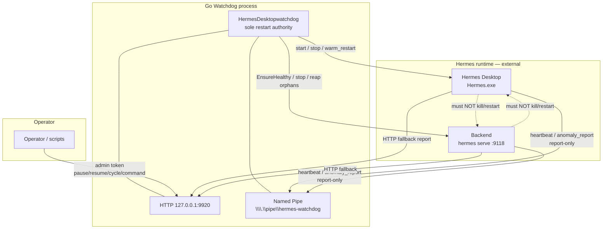
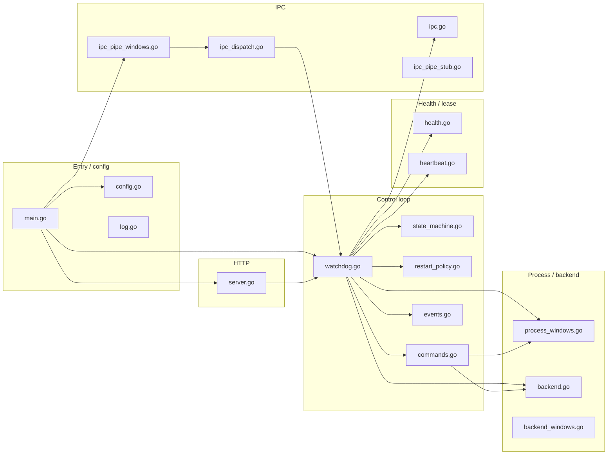
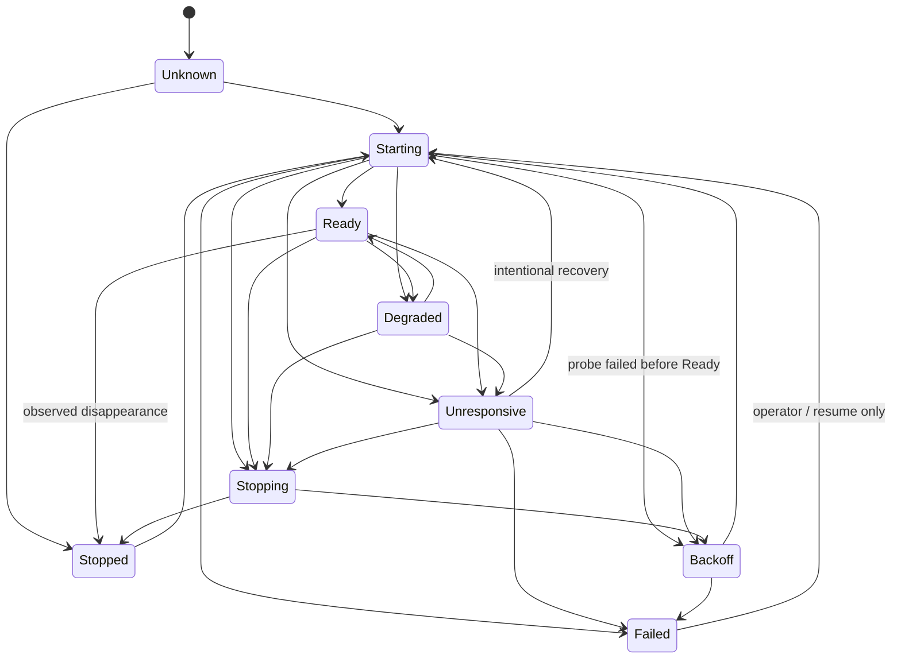
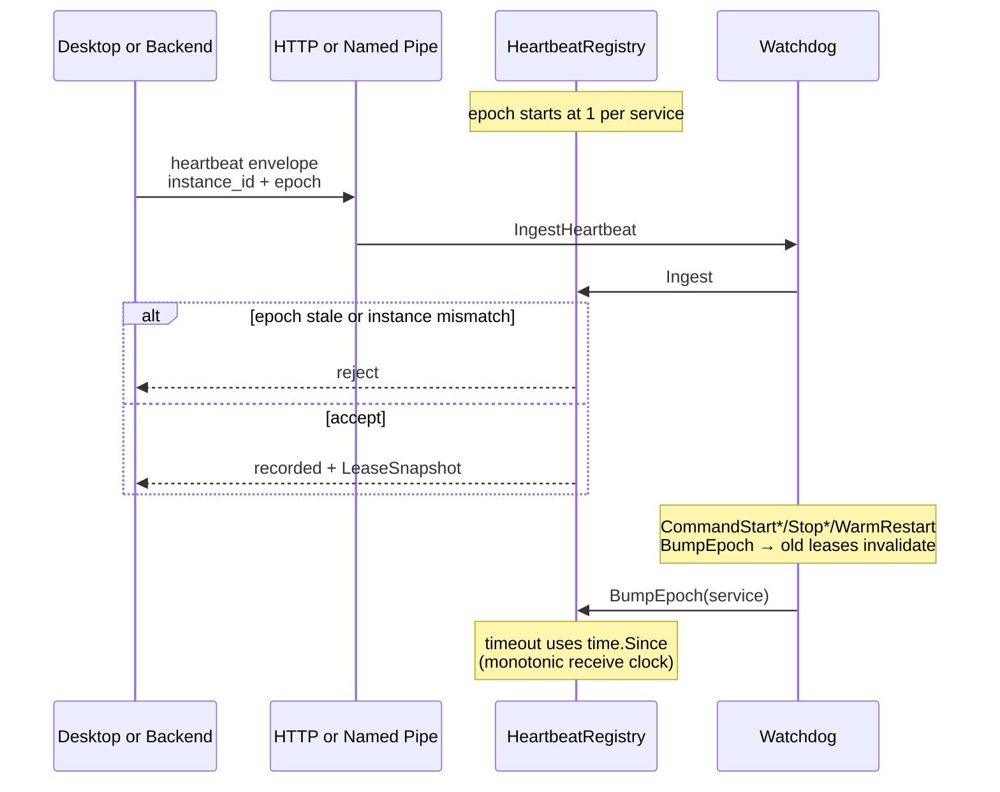
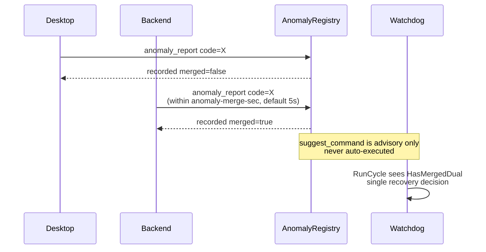
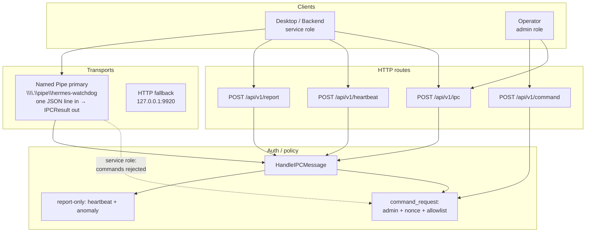

# Hermes Desktop Watchdog — Architecture

**Audience:** operators and developers working in this repository (`zapabob/HermesDesktopwatchdog`)  
**Scope:** Go Watchdog only. This document does **not** modify or prescribe hermes-agent / Hermes Desktop source trees.  
**Status date:** 2026-07-22  
**Shipped phases:** P1–P6 · Hermes adapter gaps documented (see roadmap)

---

## 1. Purpose & non-goals

### Purpose

Operator-only Windows process that keeps packaged Hermes Desktop (`Hermes.exe`) and a watchdog-managed backend (`hermes serve`) alive. It:

- probes Desktop process presence and backend multi-level health
- owns start / stop / warm-restart of both services
- applies crash-loop `RestartPolicy` (backoff → `Failed`)
- accepts heartbeats and anomaly reports over Named Pipe / HTTP
- exposes a loopback control plane for operators (`/api/status`, pause/resume, allowlisted commands)

### Non-goals

| Non-goal | Why |
|----------|-----|
| Hermes plugin / skill / MCP / cron | Out of agent tool surface ([AGENTS.md](../AGENTS.md)) |
| Official NousResearch component | Standalone ops binary |
| Free-form shell / remote code exec | Allowlisted `CommandType` only ([SECURITY.md](../SECURITY.md)) |
| Treating ops ports as Desktop backends | Reserved: `8787`, `9120`, `9920`, … |
| Implementing Hermes Desktop/Backend adapters inside this repo | Contracts only; hermes-agent is separate |
| Claiming full warm-start session restore without Hermes | Watchdog emits signals; Hermes restores durable state later |
| Changing hermes-agent in this repo | Desktop/Backend adapters are separate PRs; contract: [IPC-CONTRACT-P3.md](IPC-CONTRACT-P3.md) |

---

## 2. System context

Watchdog is the **sole restart authority**. Desktop and Backend may observe each other and **report** anomalies; they must not kill/restart peers (contract; Hermes code is not changed in this repository).



Normative authority model: [ADR § Decision 1](ADR-2026-07-21_hermes-watchdog-lifecycle-manager.md) (REQ-LM-01).

---

## 3. Component map (Go packages / files)

All sources are `package main` in the repo root (no internal modules).



| File | Role |
|------|------|
| `main.go` | Flags, data paths, lock, HTTP/tsnet, pipe, `RunLoop` |
| `config.go` | `Config`, env secrets, default data/exe paths |
| `watchdog.go` | `RunCycle` / `RunLoop`, state persistence, lock file |
| `state_machine.go` | `ServiceState` + allowed transitions |
| `restart_policy.go` | Windowed backoff / `Failed` latch |
| `commands.go` | Allowlisted `CommandType` execution |
| `health.go` | `/live`, `/ready`, `/api/status` fallback, cached `/health/deep` |
| `heartbeat.go` | Epoch/instance lease registry (monotonic timeout) |
| `ipc.go` / `ipc_dispatch.go` | Envelope, anomaly merge (T12), nonce, dispatch |
| `ipc_pipe_windows.go` | Named Pipe listener (primary on Windows) |
| `ipc_pipe_stub.go` | Non-Windows no-op |
| `backend.go` | Managed `hermes serve`, manifest `desktop-backend.json` |
| `process_windows.go` | Desktop enum, reserved ports, orphan reap, start/restart |
| `server.go` | HTTP control + report/heartbeat/command routes |
| `events.go` | JSONL restart/anomaly events |

---

## 4. State machine (`ServiceState`)

Implemented in `state_machine.go` (ADR REQ-LM-02). Desktop and Backend each hold a `ServiceState`.

**Invariant:** process exists ≠ healthy. Live-only backend maps to `Degraded`, not `Ready`.



`Failed` stops auto-restart until operator clears (e.g. resume). See phase log: [2026-07-22_phase1-state-machine_Cursor.md](2026-07-22_phase1-state-machine_Cursor.md).

---

## 5. Sequence diagrams

### 5.1 `RunCycle` recovery (sole authority)

Simplified control flow from `watchdog.go` `RunCycle`.

```mermaid
sequenceDiagram
  participant Loop as RunLoop
  participant WD as Watchdog
  participant Desk as Desktop procs
  participant BE as BackendManager / probes
  participant Pol as RestartTracker

  Loop->>WD: RunCycle()
  alt paused
    WD-->>Loop: result paused
  else restart.Failed latched
    WD->>WD: backendState = Failed
    WD-->>Loop: auto-restart suppressed
  else Desktop missing
    WD->>Desk: CommandStartDesktop
    WD-->>Loop: relaunched
  else backend live && !ready
    WD->>WD: StateDegraded (no restart storm)
    WD-->>Loop: degraded
  else backend missing / not ready
    WD->>Pol: CanAttempt?
    alt backoff
      WD-->>Loop: backoff
    else
      WD->>BE: CommandStartBackend
      alt still not ready
        WD->>Pol: RecordFailure
        opt failCount >= FailThreshold
          WD->>Desk: CommandWarmRestart (last resort)
        end
      else ready
        WD->>Pol: MarkReady
        WD->>WD: StateReady
      end
    end
  else both healthy
    WD->>Pol: MarkReady
    WD-->>Loop: up/up
  end
```

### 5.2 Heartbeat / epoch lease



Details: [phase2 log](2026-07-22_phase2-health-heartbeat_Cursor.md), ADR REQ-LM-03.

### 5.3 Anomaly T12 merge



Contract: [IPC-CONTRACT-P3.md](IPC-CONTRACT-P3.md). Tests: `TestAnomalyMergeDualReportT12`.

### 5.4 Named Pipe vs HTTP IPC



| Message | Pipe (service) | HTTP without admin | HTTP admin + nonce |
|---------|----------------|--------------------|--------------------|
| `heartbeat` | yes | yes* | yes |
| `anomaly_report` | yes | yes* | yes |
| `command_request` | **rejected** | **rejected** | allowlisted only |

\* If neither heartbeat nor admin token is configured, loopback report/heartbeat may be accepted (dev convenience). Mutating operator routes still require admin token when set; empty admin token → `403` on pause/resume/cycle/stop/command.

---

## 6. Data paths & defaults

| Artifact | Default path | Notes |
|----------|--------------|-------|
| Data dir | `%LOCALAPPDATA%\HermesWatchdog` | Override: `HERMES_WATCHDOG_DATA` / `--data-dir` |
| Lock | `{data}/watchdog.lock` | Single-instance PID lock |
| State | `{data}/watchdog.state.json` | Last cycle snapshot |
| Events | `{data}/watchdog.events.jsonl` | Machine-readable restart/anomaly |
| Log | `{HERMES_HOME}/logs/hermes-go-watchdog.log` | Default `~/.hermes` |
| Manifest | under managed backend data | `desktop-backend.json` (URL/token/port for Desktop launch env) |
| HTTP listen | `127.0.0.1:9920` | `--listen` / `--no-http` |
| Named Pipe | `\\.\pipe\hermes-watchdog` | `--ipc-pipe` / `--no-ipc-pipe` |
| Managed backend port | `9118` | `--managed-backend-port` |
| Packaged exe | `%LOCALAPPDATA%\hermes\...\Hermes.exe` or repo `apps/desktop/release/win-unpacked` | `--packaged-exe` |

Reserved ops ports (never treated as Desktop backends): see `reservedOpsPorts` in `process_windows.go` (`8787`, `9120`, `9920`, …).

---

## 7. Security model (summary)

Full policy: [SECURITY.md](../SECURITY.md).

| Control | Behavior |
|---------|----------|
| Loopback default | HTTP binds `127.0.0.1:9920` |
| Admin token | `HERMES_WATCHDOG_ADMIN_TOKEN` for mutating APIs |
| Heartbeat token | `HERMES_WATCHDOG_HEARTBEAT_TOKEN` (falls back to admin) |
| Report-only IPC | Desktop/Backend cannot execute restart commands |
| Command allowlist | `start_desktop`, `stop_desktop`, `start_backend`, `stop_backend`, `warm_restart` |
| Nonce anti-replay | Required on `command_request` |
| Path pinning | Launch only resolved packaged exe / serve via local Python |
| Single-instance lock | Prevents dual supervisors |
| Crash-loop Failed | Halts auto-restart |
| Optional tsnet | Only with explicit auth key env |

Secrets must never be committed (`.env`, auth keys, built `.exe`).

---

## 8. HTTP surface (operator glance)

| Method | Path | Auth | Purpose |
|--------|------|------|---------|
| GET | `/health` | none | Liveness |
| GET | `/api/status`, `/api/v1/status` | none | Full `WatchdogState` |
| POST | `/api/v1/heartbeat` | heartbeat/admin or loopback | Lease ingest |
| POST | `/api/v1/report` | same | Anomaly report |
| POST | `/api/v1/ipc` | role-dependent | Shared envelope |
| POST | `/api/v1/command` | **admin** + nonce | Allowlisted command |
| POST | `/api/v1/pause` \| `resume` \| `cycle` \| `stop` | **admin** | Operator control |
| POST/GET | `/api/v1/update-suppress` | **admin** | P6 update-window suppress on/off + optional TTL |

`WatchdogState` exposes `soleRestartAuthority`, `reportOnlyContract`, `leases`, `recentAnomalies`, `ipcPipe`, `warmStart`, `updateSuppress`, `jobObject`, `recovery`, per-service `ServiceState`, and restart snapshot.

---

## 9. Phase roadmap (P1–P6)

| Phase | Status | Scope | Evidence |
|-------|--------|-------|----------|
| **P1** | **Done** | `ServiceState`, `RestartPolicy`, events, sole-authority loop | [phase1 log](2026-07-22_phase1-state-machine_Cursor.md) |
| **P2** | **Done** | Multi-level health + heartbeat epoch/lease | [phase2 log](2026-07-22_phase2-health-heartbeat_Cursor.md) |
| **P3** | **Done (this repo)** | Report-only IPC (pipe + HTTP), T12 merge, allowlist | [phase3 log](2026-07-22_phase3-ipc-report-only_Cursor.md), [IPC-CONTRACT-P3.md](IPC-CONTRACT-P3.md) |
| **P4** | **Done (Watchdog-owned)** | Warm-start sequencer; interrupted ≠ success; manifest notify | [WARM-START-CONTRACT.md](WARM-START-CONTRACT.md), [phase4–6 log](2026-07-22_phase4-6_lifecycle_Cursor.md) |
| **P5** | **Done (Watchdog-owned)** | Job Object for managed backend; renderer-only policy stub (T04) | phase4–6 log |
| **P6** | **Done (Watchdog-owned)** | Update suppress (env / lock file / admin API) (T13) | phase4–6 log |

**Hermes-dependent residual gaps (honest):**

- P3/P4: Desktop/Backend must actually send heartbeats, drain, and checkpoint — adapters live in hermes-agent, not here.
- P4: session routing restore is signal-only (`session_routing_restore_signal`).
- P5: renderer recreate needs Electron IPC; Watchdog only skips full Desktop restart and emits events.
- P6: installer should write `update.lock` / set env — Watchdog honors them when present.

**Important:** P3 *contract* for hermes-agent adapters is published here; enforcing report-only inside Desktop/Backend binaries is a **separate** hermes-agent change and is **not** claimed as completed by this repository alone.

---

## 10. Related documents

| Doc | Role |
|-----|------|
| [ADR-2026-07-21_hermes-watchdog-lifecycle-manager.md](ADR-2026-07-21_hermes-watchdog-lifecycle-manager.md) | Normative lifecycle decisions (do not duplicate) |
| [IPC-CONTRACT-P3.md](IPC-CONTRACT-P3.md) | Desktop/Backend integration contract |
| [WARM-START-CONTRACT.md](WARM-START-CONTRACT.md) | P4 warm-start Watchdog↔Hermes contract |
| [OPERATOR.md](OPERATOR.md) | Short operator runbook |
| [SECURITY.md](../SECURITY.md) | Security policy |
| [AGENTS.md](../AGENTS.md) | Agent/repo constraints |
| [README.md](../README.md) | 30-second scan |

---

## 11. Diagram index

1. System context (Watchdog sole authority) — §2  
2. Go component map — §3  
3. `ServiceState` state diagram — §4  
4. `RunCycle` recovery sequence — §5.1  
5. Heartbeat / epoch sequence — §5.2  
6. Anomaly T12 merge sequence — §5.3  
7. Named Pipe vs HTTP IPC — §5.4  
